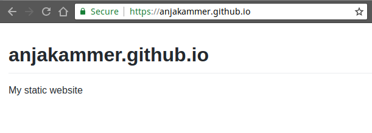
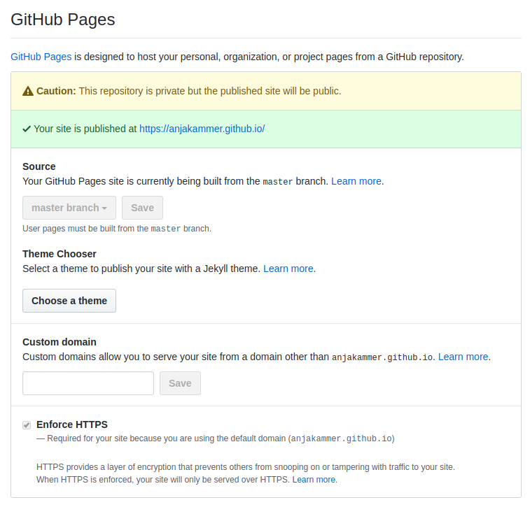

# Create a Markdown-based Website

If you did [step 2](./repository.md) - you can visit your website immediately:

`<your-account-name>.github.io`

For now you can see, the websites name and description.
Your markdown file was converted to HTML by GitHub, which your browser can read.

> 

## Create a subpage

add another Markdown file an link it in both files like so:

`### | [Home](./README.md) | [Subpage](./subpage.md) |`
> ### | [Home](./README.md) | [Subpage](./subpage.md) |

## Make it nice

GitHub Pages offers the possibility to add a theme to your Markdown files.

Got to `your_repository > Settings > Theme Chooser`

> 
