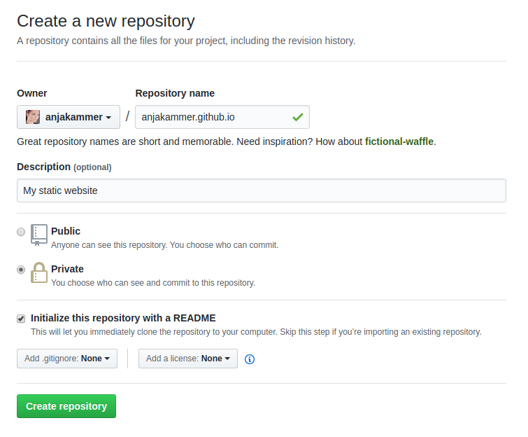

# Create a GitHub Pages Repository
[This](https://guides.github.com/features/pages/) is a full tutorial from GitHub

1. create a GitHub Repository
2. name it like `<your-account-name>.github.io`
3. tick the option, to initialize it with a README

> 
